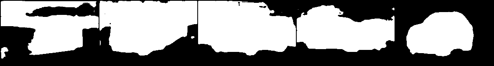

# UNet
Basic UNet architecture for semantic segmentation

Adapted from @aladdinpersson
- [x] Binary segmentation is modified
- [ ] Support for Multi-class segmentation is added 

Insights found:
- Like any other supervised-learning methods that learn priors / inductive biases, the method works only well on test data samples where model encounters similar training data distribution during the inference.
- So the model fails when it encounters out-of data distribution samples.
- Best way to tackle this would be incorporating self-supervised learning tasks with bigger models.

**Model failure cases... **

 

 

First 4 images were randomly taken from the Internet, those types of images were not used to train the model. The model was trained on images that were similar to last image. Hence the model was able to capture binary mask for that image. 